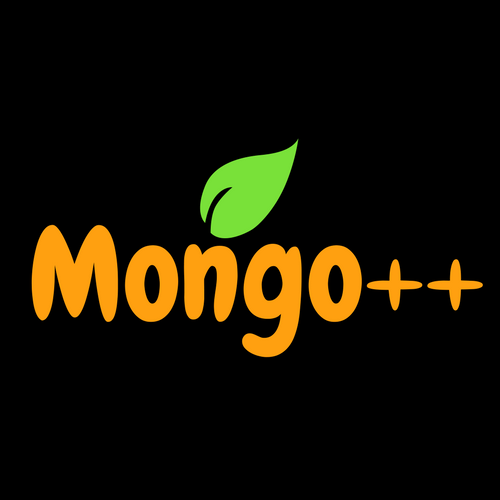

## Maturity
Level : 0

## What's Mongo++?
Mongo++ helps you to kickstart new database projects as a layer in a global project , prescribing best practices and tools to help you stay productive.
Mongo++ create a data server , a mongoDB database and a full Rest Api with common Crud using mongoose.
Mongo++ Cli (mgp) is in French for this version.

## Usage

# install mgp

npm install -g mgp

# run generator cli , in current folder :
>> mgp

# run unit tests , in generated project folder :
>> npm test

mongo++ use mocha , chai and sinon . it generate a folder '/mochawesome-report' with the Tests.

# generate docs , in generated project folder :
>> npm run docs

mongo++ use jsdoc and a folder '/out' is created for helpers.

# run the server , in generated project folder :
npm start

## Options

## Troubleshooting

## License
MIT